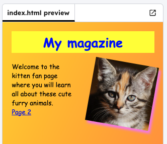

<h2 class="c-project-heading--task">Copy content</h2>

--- task ---

Select all of the code from `index.html`, copy it and then paste it into `page2.html`.

--- /task ---

--- task ---

In `page2.html`, change the `<h1>` title to the title for your new page.

--- /task ---

--- code ---
---
language: html
filename: page2.html
line_numbers: true
line_number_start: 8
line_highlights: 8
---
<h1>Kitten care</h1>
--- /code ---

--- task ---

Click **Run** and click on the link again to see the connent appear.

--- /task ---

