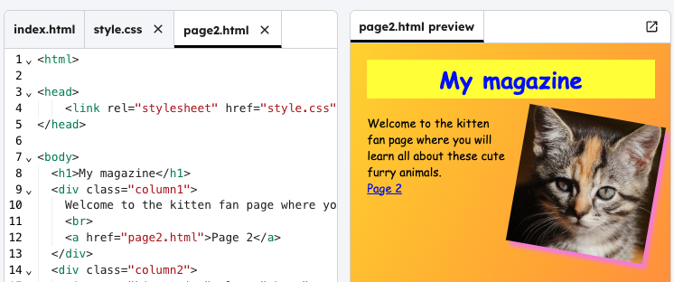

<h2 class="c-project-heading--task">Copy content</h2>

### Step 1

Select all of the code from `index.html`, copy it and then paste it into `page2.html`.

--- code ---
---
language: html
filename: page2.html
line_numbers: true
line_number_start: 1
line_highlights: 1-20
---
<html>

<head>
    <link rel="stylesheet" href="style.css">
</head>

<body>
  <h1>My magazine</h1>
  

    Welcome to the kitten fan page where you will learn all about these cute furry animals.
     
    <a href="page2.html">Page 2</a>
  

  

    
  

</body>

</html>
--- /code ---

### Step 2

Click **Run** and click on the page 2 link to see the content appear. It will look the same as the home page.

