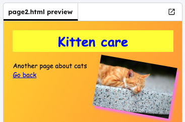

<h2 class="c-project-heading--task">Edit page 2</h2>

In `page2.html`, change the `<h1>` title to the title for your new page.

<h2 class="c-project-heading--explainer">Follow these instructions</h2>

## Step 1

Add a link back to `index.html` so that you can click on it to get back to the first page

--- code ---
---
language: html
filename: page2.html
line_numbers: true
line_number_start: 8
line_highlights: 8, 10-11
---
  <h1>Kitten care</h1>
  

    Another page about cats
     
    <a href="page2.html">Go back</a>
  

  

    
  

--- /code ---

## Step 2

Click **Run** and click on the link again to see the content change.

## Now run your code

Confirm the observable result.
