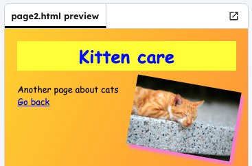

<h2 class="c-project-heading--task">Challenge</h2>

--- task ---

Upgrade your website magazine!

--- /task ---

--- task ---

Add a link from `page2.html` back to `index.html` so that you can click on it to get back to the first page

--- /task ---

--- task ---

Add a new `font-family` and `color` in the CSS. 

--- /task ---

--- task ---

Fill in the content in `page2.html`. Look on the **images** tab to see some other images you could include on your page. 

--- /task ---

--- task ---

Experiment with style and adding content until you have it how you want. Here is an example of a finished magazine:

--- /task ---