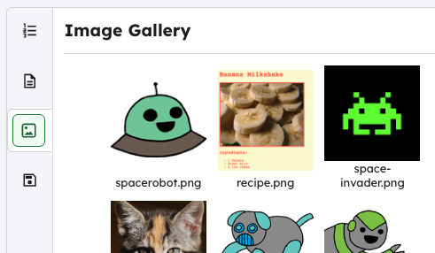
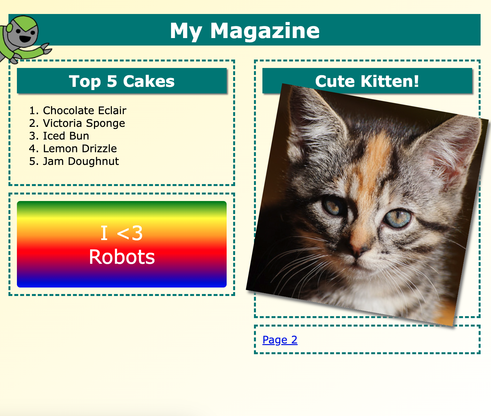

<h2 class="c-project-heading--task">Challenge</h2>

Upgrade your website magazine!

<h2 class="c-project-heading--explainer">Follow these instructions</h2>

## Step 1

Style the second page of the website. Add a new `font-family` and change the `color` in CSS.

## Step 2

Fill in the content in `page2.html`. Add more text, and look on the **images** tab to see some other pictures you could include on your page. 

## Step 3

Experiment with style and adding content until you have it how you want. Here is an example of a finished magazine.

## Now run your code

Click **Run** and check that your second page has your new styling and extra content.
