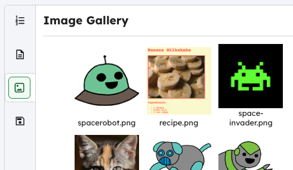
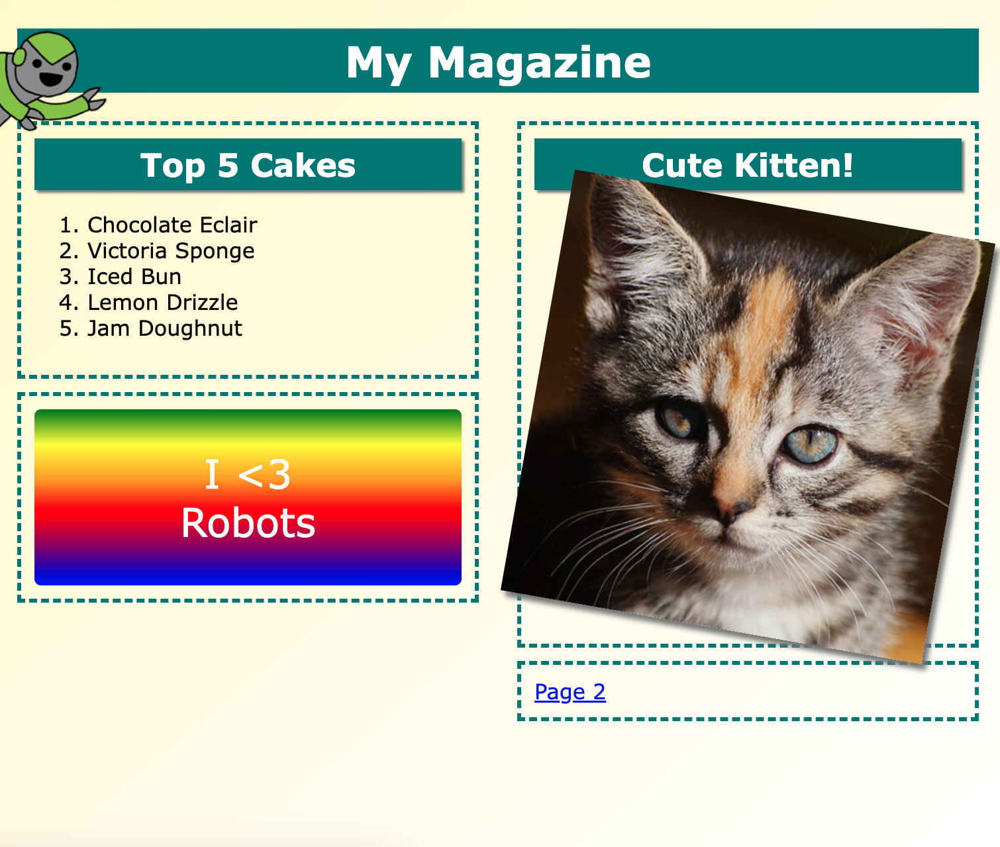

## Challenge

Upgrade your website magazine!

> [!CHALLENGE]
> ## Style the second page of the website
> Add a new `font-family` and change the `color` in CSS.

> [!CHALLENGE]
> ## Fill in the content in `page2.html`
> Add more text, and look on the **images** tab to see some other pictures you could include on your page.
>
> 

> [!CHALLENGE]
> ## Experiment with style and content
> Add to your magazine until you have it how you want. Here is an example of a finished magazine.
>
> 
