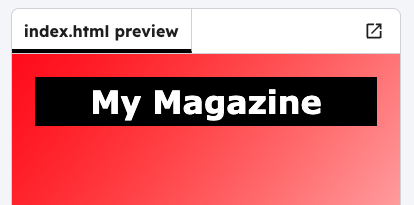

<h2 class="c-project-heading--task">Heading</h2>

--- task ---

Decide on a name for your magazine and add it as an `<h1>` heading.

--- /task ---

--- code ---
---
language: html
filename: index.html
line_numbers: true
line_number_start: 7
line_highlights: 8
---
<body>
	<h1>My Magazine</h1>

</body>
--- /code ---
--- task ---

Click **Run** and see your title in the visual editor.

--- /task ---

