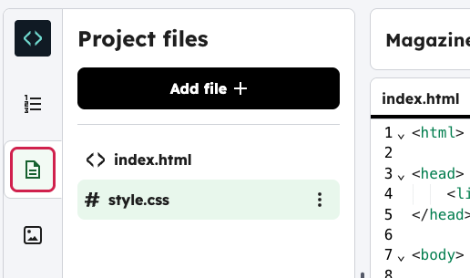
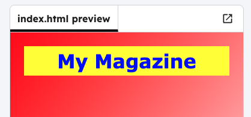

<h2 class="c-project-heading--task">STEP TITLE</h2>

Change the style of the heading.

<h2 class="c-project-heading--explainer">Follow these instructions</h2>

## Step 1

In the sidebar, open the `style.css` file.  

## Step 2

Change the colours in `color` and `background` using the code below.

--- code ---
---
language: css
filename: style.css
line_numbers: true
line_number_start: 1
line_highlights: 3-4
---
h1 {
    text-align: center;
    color: blue;
    background: yellow;
    padding: 5px;
}
--- /code ---

## Step 3

Click **Run** and see your style in the visual editor. Experiment with colours until you find a combination you like.

### Tip

You can find more CSS colour names [here](http://jumpto.cc/colours){:target="_blank"}.

## Now run your code

Click **Run** and check that your title is styled with blue text on a yellow background.
