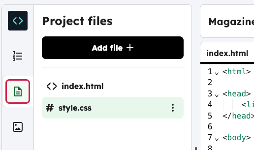
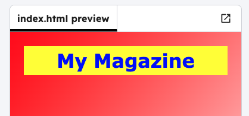

## Change the style

Change the style of the heading.

## Step 1

In the sidebar, open the `style.css` file.



## Step 2

Change the colours in `color` and `background` using the code below.

```css filename="style.css" line_numbers="true" line_number_start="1" line_highlights="3-4"
h1 {
    text-align: center;
    color: blue;
    background: yellow;
    padding: 5px;
}
```

## Now run your code

Click **Run** and see your style in the visual editor. Experiment with colours until you find a combination you like.



> [!TIP]
> You can find more CSS colour names [here](http://jumpto.cc/colours){:target="_blank"}.
