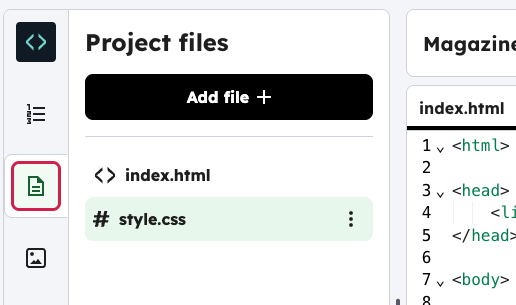

<h2 class="c-project-heading--task">STEP TITLE</h2>

--- task ---

Change the style of the heading.

--- /task ---

Magazine websites often have lots of small items on a page. Style your heading so that it stands out.

--- task ---

In the sidebar, open the `style.css` file.  

--- /task ---

--- task ---

Copy this code example, and edit the `color` and other elements to change the style.

--- /task ---

--- code ---
---
language: css
filename: style.css
line_numbers: true
line_number_start: 1
---
h1 {
    text-align: center;
    color: white;
    background: black;
    padding: 5px;
}
--- /code ---
--- task ---

Click **Run** and see your style in the visual editor.

--- /task ---

