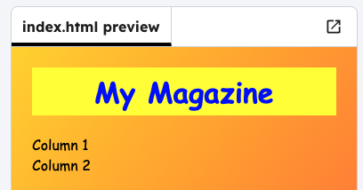

<h2 class="c-project-heading--task">Change the background</h2>

--- task ---

Look at the CSS style for `body`. Change the colours of the **background** and the **font** to your own choices.

--- /task ---

--- task ---

Try adding other fonts, for example: `arial`, `impact`, `tahoma` or `Comic Sans MS`

--- /task ---

--- code ---
---
language: css
filename: style.css
line_numbers: true
line_number_start: 8
line_highlights: 9-10
---
body {
  background: linear-gradient(to bottom gold, , coral);
  font-family: Comic Sans MS;
  padding: 15px;
}

--- /code ---

--- task ---

Click **Run** and see your background and font change in the visual editor.

--- /task ---

