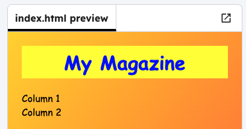

<h2 class="c-project-heading--task">Add columns</h2>

### Step 1

Websites often use multiple columns. Create a two column layout for your magazine.

### Step 2

First add the columns in HTML. Select the `index.html` file and add code to create two columns. 

--- code ---
---
language: html
filename: index.html
line_numbers: true
line_number_start: 7
line_highlights: 9-14
---
<body>
<h1>My magazine</h1>

	Column 1

	Column 2

</body>

--- /code ---

### Step 3

Click **Run** and see your the text in two columns. They need to be styled with CSS to have a two column layout.

