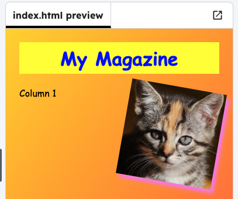

<h2 class="c-project-heading--task">Align the columns</h2>

--- task ---

Make the columns `float` to the left or right.

--- /task ---

--- task ---

Switch back to `style.css` and find the styles for `column1` and `column2`.

--- /task ---

--- task ---

Add a `float` property to each column style so that one floats to the left and the other floats to the right.

--- /task ---

--- code ---
---
language: css
filename: style.css
line_numbers: true
line_number_start: 14
line_highlights: 16, 21
---
.column1 {
    width: 48%;
	float: left;
}

.column2 {
    width: 48%;
	float: right;
}

--- /code ---
--- task ---

Click **Run** and see your how your columns align.

--- /task ---

