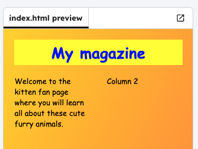

<h2 class="c-project-heading--task">Align the columns</h2>

Add some text to your web page in `Column 1`.

<h2 class="c-project-heading--explainer">Follow these instructions</h2>

## Step 1

--- code ---
---
language: html
filename: index.html
line_numbers: true
line_number_start: 8
line_highlights: 10
---
<h1>My magazine</h1>

    Welcome to the kitten fan page where you will learn all about these cute furry animals.

--- /code ---

## Step 2

## Now run your code

Confirm the observable result.
