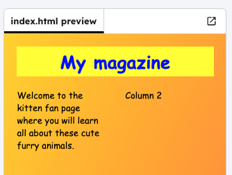

<h2 class="c-project-heading--task">Add an image</h2>

--- task ---

Replace the `Column 2` text with a kitten picture.

--- /task ---

--- task ---

Add a `photo` class to the image so that you can style it.

--- /task ---

### Tip

An HTML **class** is a way to choose certain parts of a web page so you can change how they look using CSS.

--- code ---
---
language: html
filename: index.html
line_numbers: true
line_number_start: 12
line_highlights: 13
---

	

</body>

--- /code ---
--- task ---

Click **Run** and see your how your image appear.

--- /task ---

