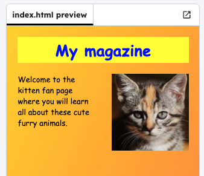

<h2 class="c-project-heading--task">Add an image</h2>

Replace the `Column 2` text with a kitten picture.

<h2 class="c-project-heading--explainer">Follow these instructions</h2>

## Step 1

Switch to index.html and add the ``.

--- code ---
---
language: html
filename: index.html
line_numbers: true
line_number_start: 12
line_highlights: 13
---

	

</body>

--- /code ---

## Step 2

Click **Run** and see your how your image appear.

### Tip

The image has a `photo` class. An HTML **class** is a way to choose certain parts of a web page so you can change how they look using CSS.

## Now run your code

Click **Run** and check that the kitten picture appears in the second column.
