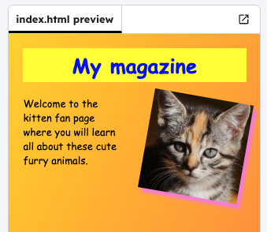

<h2 class="c-project-heading--task">Another page</h2>

--- task ---

Add another page to your magazine website.

--- /task ---

--- task ---

Click **Add file** and call your new file `page2.html`:

--- /task ---

--- task ---

Go back to `index.html`. Add a link to your second page using the code below.

--- /task ---

--- code ---
---
language: html
filename: index.html
line_numbers: true
line_number_start: 8
line_highlights: 11
---
<h1>My magazine</h1>

	Welcome to the kitten fan club
    <a href="page2.html">Page 2</a>

--- /code ---

--- task ---

Test that you can click on your new link and move to page 2 of your magazine.

--- /task ---

