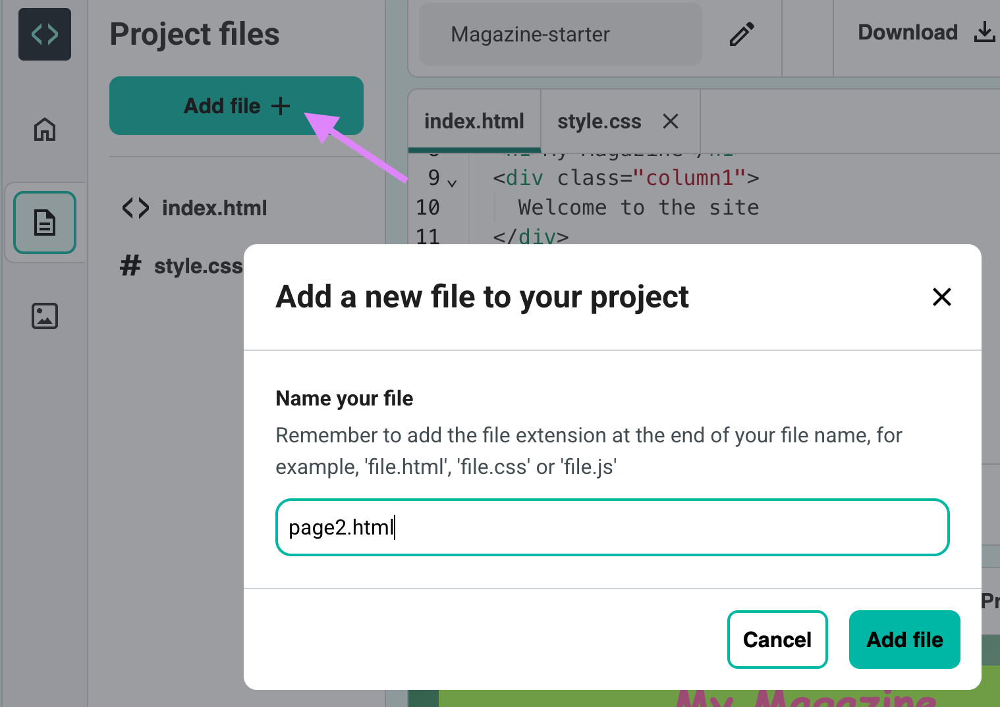
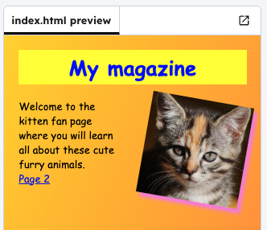

<h2 class="c-project-heading--task">Another page</h2>

Add another page to your magazine website.

<h2 class="c-project-heading--explainer">Follow these instructions</h2>

## Step 1

Click **Add file** and call your new file `page2.html`:

## Step 2

Go back to `index.html`. Add a new line with ` ` and a link to your second page using the code below.

--- code ---
---
language: html
filename: index.html
line_numbers: true
line_number_start: 8
line_highlights: 12
---
  <h1>My magazine</h1>
  

    Welcome to the kitten fan page where you will learn all about these cute furry animals.
     
    <a href="page2.html">Page 2</a>
  

--- /code ---

## Step 3

Test that you can click on your new link and move to page 2 of your magazine.

## Now run your code

Confirm the observable result.
