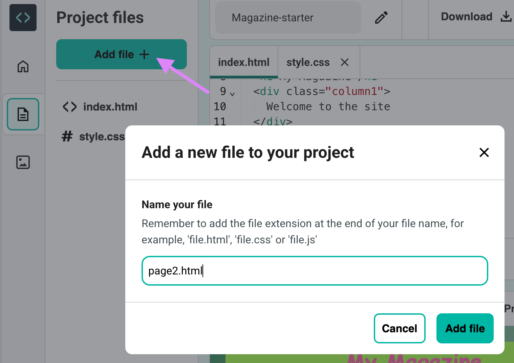
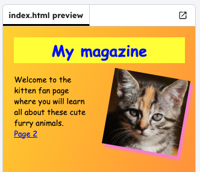

## Another page

Add another page to your magazine website.

## Step 1

Click **Add file** and call your new file `page2.html`:



## Step 2

Go back to `index.html`. Add a new line with `<br>` and a link to your second page using the code below.

```html filename="index.html" line_numbers="true" line_number_start="8" line_highlights="12"
  <h1>My magazine</h1>
  <div class="column1">
    Welcome to the kitten fan page where you will learn all about these cute furry animals.
    <br>
    <a href="page2.html">Page 2</a>
  </div>
```

## Now run your code

Test that you can click on your new link and move to page 2 of your magazine.

